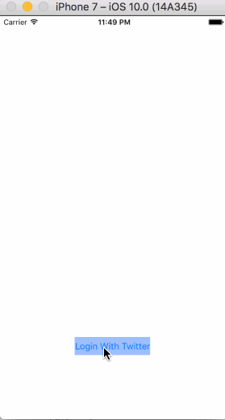

# TwitterClient
Time spent: **7** hours spent in Part 1
Time spent: **11** hours spent in Part 2

## User Stories

The following **required** functionality is completed:

- [x] Hamburger menu
- [x] Dragging anywhere in the view should reveal the menu.
- [x] The menu should include links to your profile, the home timeline, and the mentions view.
- [x] The menu can look similar to the menu below or feel free to take liberty with the UI.
- [x] Profile page
- [x] Contains the user header view
- [x] Contains a section with the users basic stats: # tweets, # following, # followers
- [x] Shows the user timeline
- [x] Home Timeline

The following **optional** features are implemented:

- [x] Implement map view of restaurant results

## Video Walkthrough

Here's a walkthrough of implemented user stories:

# Part 1

# Part 2

